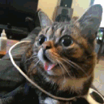

# vintall.github.io
<html>
	<head>
		<title>
			Main
		</title>
		<link id="pagestyle" rel="stylesheet" type="text/css" href="styles_day.css" media="screen"/>
		 
		
	</head>
	<body>
	<button type="button" onclick="swapStyleSheet('styles_day.css')">White Theme</button>
<button type="button" onclick="swapStyleSheet('styles_night.css')">Dark Theme</button>
 

		
		<h1 class="ali_center">Процес розробки Web-сайту</h1>
		
		

		

		<b>
		Лабораторна робота #1   
		Зробив студент: Ільяшенко Єгор   
		Группа: ПА_19_2  
		</b>
		

			

		 
		 
		 
		
		

		<a href='Сontent.html'> Контент</a>  
		 
		<a href='https://www.w3schools.com/css/tryit.asp?filename=trycss_default'>Пример CSS </a>
			 
		<a href='https://www.w3schools.com/tags/default.asp'>HTML Теги</a>
		
			 
		<a href='http://htmlbook.ru/html/details'>Как использовать тег &ltdetails&gt?</a>
		
			
		
		

	</body>
</html>
